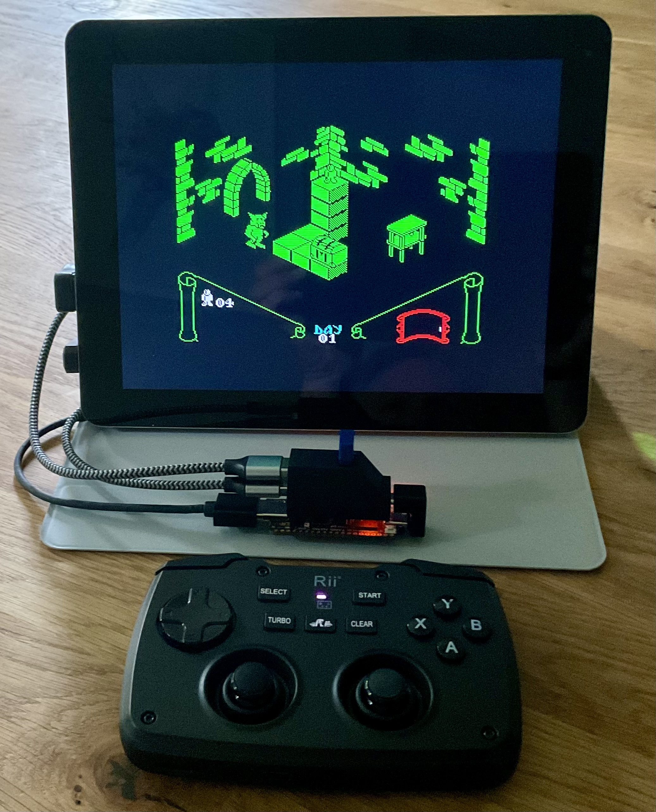
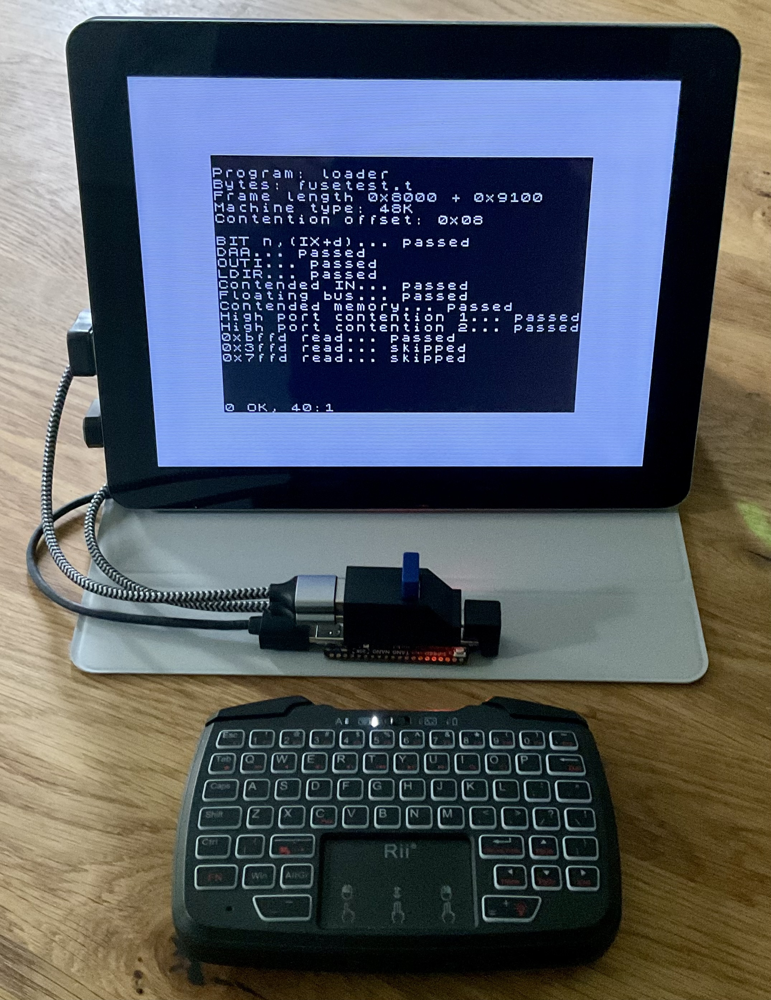

# ZX Spectrum core for the Tang Nano 20K FPGA

A comprehensive ZX Spectrum reimplementation for the Tang Nano 20K FPGA board, delivering authentic retro computing experience with modern enhancements.

## Features

### Supported Models
- **ZX Spectrum 48K** - Switch with F2
- **ZX Spectrum 128K** - Switch with F1 (default)
- **Pentagon 128** - Switch with F3

### Enhanced Graphics Modes
- **Timex HiRes and HiColor** - Toggle with Shift+F4 (enable) / F4 (disable)
- **ULAplus** - Toggle with Shift+F5 (enable) / F5 (disable)
- **Display modes** - Cycle through color → B&W → green → amber with F7
- **Scanlines** - Cycle interlacing options with F8

### Storage & File Support
- **SD card support** via DivMMC / ESXDOS implementation
- **Supported formats**: TAP, TRD, SCL, and other ESXDOS-compatible formats

### Audio
- **TurboSound FM** with dual YM2203 sound chips

### Connectivity
- **Video and Audio output** via HDMI
- **USB support** for keyboard, joystick, and gamepad
- **Kempston joystick** emulation for USB joysticks

### Control Keys
- **F1** - ZX Spectrum 128K mode
- **F2** - ZX Spectrum 48K mode
- **F3** - Pentagon 128 mode
- **F4** - Disable Timex HiRes/HiColor (default)
- **Shift+F4** - Enable Timex HiRes/HiColor
- **F5** - Disable ULAplus (default)
- **Shift+F5** - Enable ULAplus
- **F7** - Cycle display modes (color → B&W → green → amber)
- **F8** - Cycle scanline modes
- **F11** - Reset
- **DEL** - NMI (ESXDOS menu)

## Installation

1. **Flash the ROM file**
   ```
   openFPGALoader --external-flash -o 0x300000 zx-nano.bin
   ```
   The binary includes ZX Spectrum 48, 128, ESXDOS, and TR-DOS ROMs.

2. **Flash the bitstream**
   ```
   openFPGALoader zx-nano.fs -f
   ```

3. **Prepare SD card**
   - Format as FAT32
   - Download and unpack ESXDOS from https://esxdos.org
   - Optional (but recommended) - download and unpack ESXDOS browser with long file name support from http://www.thefossilrecord.co.uk/author/bob_fossil_esq/ (direct link http://www.thefossilrecord.co.uk/wp-content/uploads/zx/BROWSE_latest.zip)

4. **Install FPGA Companion**
   - Follow instructions at https://github.com/MiSTle-Dev/FPGA-Companion
   - Supports both internal BL616 and external FPGA Companion (tested with M0S Dock)

## Requirements

- Tang Nano 20K FPGA board
- SD card (FAT32 formatted)
- USB keyboard
- Optional: USB joystick/gamepad
- HDMI display

## Screenshots

### Knight Lore


### Across the Edge Demo


*Modern demo utilizing enhanced graphics modes*

### FUSE test


## ROM Files Notice

The ROM files included in this project contain software that is the property of their respective copyright holders.

## License

This project is released under the MIT License. See the [LICENSE](LICENSE) file for details.

## Acknowledgments

This project builds upon the work of several other projects and contributors:

- **MiSTer FPGA** - ZX Spectrum core
- **Andy Karpov's projects** - https://github.com/andykarpov
- Original ZX Spectrum implementation with enhancements for modern FPGA platforms

Special thanks to all contributors to the open-source FPGA and retro computing communities.
